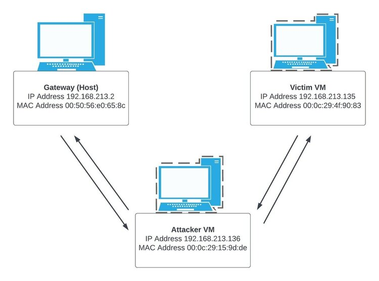
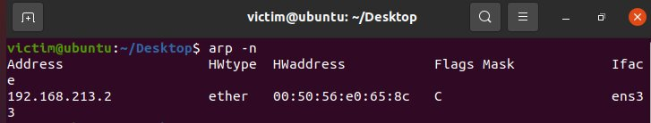
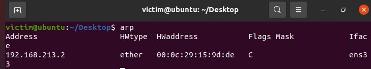

# ARP Spoofer tool in Python

The ARP Spoofer is a Python tool designed to manipulate Address Resolution Protocol (ARP) tables and intercept network traffic between a victim and its gateway.

Note: This tool is intended for educational purposes only.


## Prerequisites
Two Ubuntu virtual machines with sudo access (attacker and victim).


## Files Overview

- `ARP_spoofing.py` executes the ARP poisoning attack by sending a continuous stream of ARP packets to manipulate the ARP cache of both the victim and the gateway.

- `sniff_forward.py` sniffs and forwards the intercepted packets between the victim and the gateway.

- `config.txt` contains specific parameters that align with the user's network setup of their individual machines.

- `validation.py` contains functions to validate the parameters stored in the config.txt file.


## Virtual Machines Setup

1. On both VM's change the network adapter setting to "NAT".
2. Install the following on the attacker VM:
     * net-tools: ```sudo apt install net-tools```
     * pip3: ```sudo apt install python3-pip```
     * scapy: ```pip3 install scapy``` (Note: save the path to scapy printed at the end of the installation.)
3. Allow IP forwarding on the attacker VM: 
    ```bash
      sysctl -w net.ipv4.ip_forward=1
      ```


## Usage

1. Clone this repository to the attacker VM.
2. Edit the `config.txt` file with the following parameters:
     * Interface: use ```ip a``` on attacker machine
     * Victim MAC: use ```ip a``` on victim machine
     * Victim IP: use ```ip a``` on victim machine
     * Gateway MAC: use ```arp -n``` on attacker/victim machine
     * Gateway IP: use```ip r``` on attacker/victim machine
     * Attacker MAC: use ```ip a``` on attacker machine
     * Sys Path: use path to Scapy installation (saved during Scapy installation).
3. Run the following commands on separate terminals on the attacker VM:
    ```bash
      sudo python3 ARP_spoofing.py
      ```
    ```bash
      sudo python3 sniff_forward_ethtool.py
      ```

   
## Demo and Testing



Before running the ARP Spoofing, check the victim's ARP cache using ```arp``` command and observe the gateway's MAC address:



Run the ARP Spoofing tool and recheck the victim's ARP cache to see the attacker's MAC address instead of the gateway MAC address:


